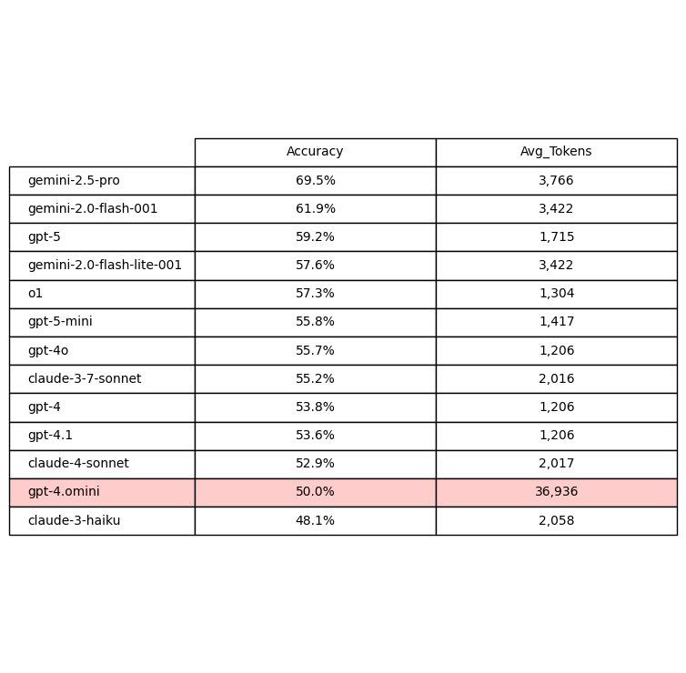

# [DARC Intern Project] Building Customizable LLM Evaluation Pipelines for Research

> Stanford's AI Playground allows researchers and staff to have access to almost 20 LLMs via their API. How do users determine which model is best suited for their needs? We built a pipeline that delivers a clear ranking of how different models perform on a set of benchmarks related to processing table based images.

---

## Table of Contents

- [Context](#context)
- [Pipeline Overview](#pipeline-overview)
- [Try It Yourself](#try_it_yourself)
- [Findings](#findings)
- [Next Steps](#next-steps)

---

## Context

Business and Social Science research, like the kind done at Stanford GSB, often requires data to be parsed from tables in scanned documents. These tables frequently have mixed resolutions, inconsistent formatting, and dense amounts of information which makes manual information extraction a time consuming task. Can we viably outsource this to LLMs?

### LLM Decision Fatigue

Choosing the right LLM is a deceptively tough task. The best choice LLM often depends on what images are being processed, what information needs to be extracted, and how much of a priority efficient token usage takes. Researchers often don't have the time to test models individually. New versions of models come out rapidly and their predecessors get retired just as frequently, when is it worthwhile for user to modify their existing workflows with more recent LLMs?

### Our Approach

The goal of this project is to provide a personalized source of truth for LLM data parsing. As a proxy for typical research documents we used 34 scanned newspaper TV guides that varied in formatting and PDF clarity. These images were processed by 13 multimodal LLMs for the following 6 benchmarks:

    - 1. Newspaper Name: The name of the newspaper the tv guide is published in.
    
    - 2. Newspaper Date: The date the the newspaper was published on.

    - 3. Day of Week: The day of the week the TV guide is for.

    - 4. TV Guide Date: The date that the TV guide is for.

    - 5. First Program: The name of the program for the first channel listed and the earliest time slot.

    - 6. First Channel: The name of the first channel listed.

The unique combinations of images, models, and benchmarks amounted to 2,730 tasks that were fed through our pipeline.

---

### Pipeline Overview

We designed the pipeline to be modular so that changes to inputs (models, images, benchmarks) could be easily made with minimal changes to the main script. 


---

## Try It Yourself

If you're interested in reproducing this worflow, or customizing it for your specfic benchmarks, you can follow the below steps.

### Clone the Repository

```bash
git clone https://github.com/gsbdarc/LLM_benchmarks
cd LLM_benchmarks
```

### Create and Activate a Virtual Environment (YENs)

```bash
/usr/bin/python3 -m venv venv
source venv/bin/activate
pip install -r requirements.txt
```

### Create and Activate a Virtual Environment (Sherlock)

Recommended: create new git branch for Sherlock

```
git checkout -b sherlock
```

Request compute resources (normal, dev, or gsb) to create a venv.

```
salloc -p normal -t 1:00:00 -c 1

module load python/3.12
/usr/bin/python3 -m venv venv
source venv/bin/activate
pip install -r requirements.txt
```

### Environment Variables

Create a `.env` file in the project root with:

```text
OPENAI_API_KEY=your_key_here
STANFORD_API_KEY=your_key_here
BASE_DIR = "your/base/directory/LLM_Benchmarks"
```

> ⚠️ Note: as models get added & removed from the Stanford AI API you will need to submit a ticket to update your API key.

### Update Inputs (`LLM_benchmarks/inputs/`)

#### `models.json`

Defines which LLMs should be used to process tasks and their model-specific configurations, add or remove as needed.

Example:
```json
{
    "0" : {
        "model": "gpt-4",
        "family": "gpt",
        "max_context_input": 128000,
        "max_context_output": 4096,
        "max_context_window": 132096}
}
```

Note: max_context parameters are helpful for reference but not actually needed to run this pipeline. 

#### `benchmarks.json`

Defines **benchmark tasks** executed by LLMs.

Each benchmark should include:
- A unique ID
- A benchmark task name
- A system prompt
- A user prompt
- A benchmark task description
- An expected output schema

Example:
```json
{
    "0" : {
        "task_name": "newspaper_name",
        "system_prompt": "You are a metadata extraction assistant. Extract information from newspaper TV guide image. Always return valid JSON matching the exact schema provided.",
        "user_prompt": "Extract the newspaper name from this image.",
        "task_description": "Extraction: LLM should extract the name of the newspaper the TV guide is published in.",
        "schema":{
            "class_name": "NewspaperName", 
            "fields":{
                "newspaper_name": "str"}}}
}
```
### Run scripts (`LLM_benchmarks/scripts/`)

#### `1.pdf_to_png.py`

Upload PDFs to `LLM_Benchmarks/inputs/data/pdfs/`
Converts PDFS into grayscale PNGs, saves files to `LLM_Benchmarks/iputs/data/pngs/`.
Prints PNG paths and file sizes in MBs.

#### `2.make_index.py`

Upload CSVs to `LLM_Benchmarks/inputs/data/csvs/`.
There should be a source of truth CSV for each PDF, naming should be the same excluding .png/.csv.
Creates a JSON snapshot of paths for PNGs and their source of truth CSVs.

#### `3.create_mapping.py`

Creates a mapping file that: 
(1) finds all unique combinations of selected benchmarks, models, and images
(2) assigns a unique task id to each one
(3) saves these results into a csv file to be used in main.py

#### `4.extract_ground_truth.py`

Iterates through all of the CSVs in the image_index.
Creates/updates ground truth JSON with the correct benchmark values.

> ⚠️ Note: this script needs to be customized based on what the benchmarks are.

#### `5.main.py`

Orchestrates processing of a single task.
Tasks are loaded via the mapping.csv file
If the task has not already been processed then the corresponding benchmark, model, and image are loaded from their respective JSONs.
A pydantic model is dynamically generated and inputs are passed into an LLM via Stanford API.
The following outputs are saved as an individual JSON file to `LLM_Benchmarks/outputs/results/results_{task_id}.json`

```json
{
  "0": {
    "output": "Arizona Republic",
    "model_name": "gpt-4",
    "model_id": "1",
    "image_id": "0",
    "benchmark_name": "newspaper_name",
    "benchmark_id": "0",
    "completion_tokens": 9,
    "total_tokens": 1196,
    "status": "processed"
  }
}
```

Depending on whether you're working in YENs or Sherlock edit the appropriate SLURM script and run the array job.

Example:
```bash
sbatch sherlock.slurm
```

#### `6.combine_check_results.py`
Loads all results within the `LLM_Benchmarks/outputs/results/` directory.
Combines results into a single DataFrame.
Saves the results to `LLM_Benchmarks/outputs/results/metrics/combined_results.json`
Prints the total number of successful and unsuccessful tasks, returns dictionary of error messages with counts.

#### `7.compute.py`
Loads combined_results.json and filters for tasks that have been processed.
Evaluates model outputs compared to ground truth, assigns a accuracy score.
Saves results as a `LLM_Benchmarks/outputs/results/metrics/metrics.json`

---

## Findings

After reviewings the results we found that gemini-2.5-pro was the most accurate multimodal model in the Stanford AI Playground API at the time of testing (February 25th 2026). 

### Accuracy by Model

Overall model accuracy across all benchmarks and images.


### Accuracy by Benchmark

Simple metadata extraction benchmarks (Newspaper Name, Newspaper Date) had the highest accuracy while LLMs struggled to return accurate results for benchmarks that required some reasoning (TV Guide Date) and scanning the document (First Channel, First Program).


Double clicking into these document scanning benchmarks we found that the Gemini models outperformed their peers.


### Accuracy by Image Id

When analyzing results by image id we found that there was about a 40% difference between the image associated with the lowest accuracy and the image associated with the highest accuracy.


### Token Usage

Looking at model accuracy alongside average token usage showed that even though gpt-4.omini was the 2nd to least accurate LLM it used almost 10x the amount of tokens as the most accurate model (gemini-2.5-pro) for a single task.



Double clicking into metadata extraction benchmarks Newspaper Name and Newspaper Date found similar results could be produced with varying token amounts. GPT-4 models returned Newspaper Name just as accurately as gemini-2.5-pro (82.9%) but only required 1/3 the amount of tokens (1203). Similarly o1 got Newspaper Date correct 100% of the time but only needed 1/4 the number of tokens as gemini-2.5-pro. 

### Limitations

While building and testing this pipeline we identified a couple of opportunties of improvement related to the Stanford AI Playground API. 

Changes to avaiable models are not always consistently announced and often require manual combing through the ai-playground slack channel. Once these changes go into effect API keys need to be rerequested, otherwise they continue to reflect access to models that are no longer available. It would be helpful if API keys would automatically remove retired models and request forms would allow users to signal that they want access to all future models as well.

Another method to increase transparency could be publishing the estimated cost of a token. Right now API cost reports are available on a monthly basis so it's difficult to get a real time sense of what a project may cost. Often times these are small amounts but for larger sets of task this could allow pipelines to run more efficiently.

---

## Next Steps

In order to create a more robust pipeline that delivers a comprehensive assessment of LLM capabilities we're planning on implementing the following:

- [] Add external models to the pipeline
- [] Modify pipeline to evaluate effectiveness of OCR + LLM data extraction with a variety of OCRs (Textract, LLAMA Index, etc.) 

