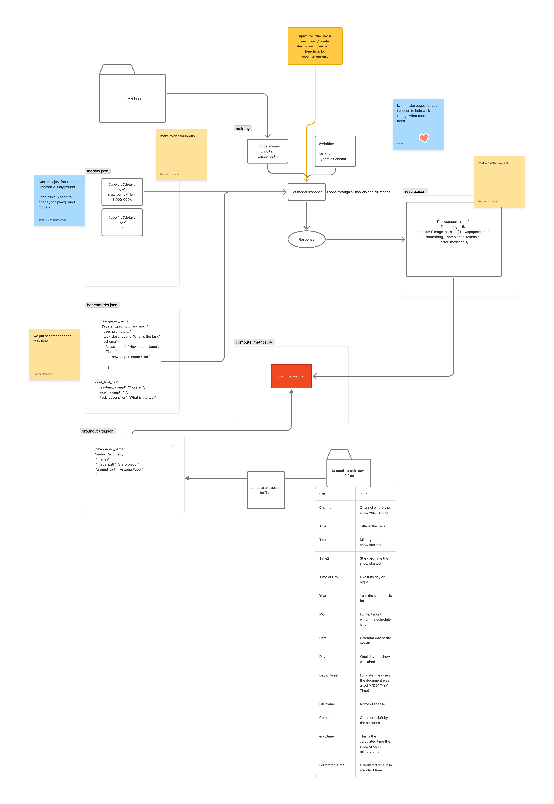

# LLM Benchmarking Project

## Project Goal

The goal of this project is to **develop and evaluate benchmark suites for multimodal large language models (LLMs)**, with a primary focus on **image-based extraction, processing, and reasoning tasks**.

- **Current focus**: Evaluating models available through the **Stanford AI Playground API**
- **Future-ready design**: The architecture is intentionally flexible to support:
  - Non-Playground LLMs
  - Additional multimodal tasks
  - New evaluation metrics
  - Changes in prompt or schema design

This repository separates **configuration, data, and execution logic** so that benchmarks can evolve without major code refactors.

---

## Setup Instructions

### Clone the Repository

```bash
git clone https://github.com/gsbdarc/LLM_benchmarks
cd LLM_benchmarks
```

---

### Create and Activate a Virtual Environment

```bash
/usr/bin/python3 -m venv venv
source venv/bin/activate
pip install -r requirements.txt
```

---

### (Optional but Recommended) Create a Jupyter Kernel

```bash
source venv/bin/activate
pip install ipykernel
python -m ipykernel install --user --name=venv
```

---

## Environment Variables

Create a `.env` file in the project root with:

```text
OPENAI_API_KEY=your_key_here
STANFORD_API_KEY=your_key_here
```
---

## High-Level Directory Structure

```
├── venv/
├── logs/
├── dev/
│   ├── development_notebooks/
│   └── archive/
└── LLM_benchmarks/
    ├── inputs/
    │   ├── models.json
    │   ├── benchmarks.json
    │   └── data/
    │       ├── pdfs/
    │       ├── pngs/
    │       └── csvs/
    ├── outputs/
    └── scripts/
```

## Logs (`logs/`)

Results from prior evaluations of LLM calls, mostly GPT and LLAMA

---

## Development Workspace (`dev/`)

This folder is used for **iteration, experimentation, and debugging**.

### `development_notebooks/`
- Jupyter notebooks for:
  - Prompt prototyping
  - Model behavior exploration
  - Debugging Base64 encoding or schemas
  - Testing metric logic
  - Testing experiment pipelines

### `archive/`
- Older or deprecated notebooks
- Retained for historical context only

> ⚠️ Code in `dev/` is not considered production-ready.

---

## Input Configuration (`LLM_benchmarks/inputs/`)

These files define **what gets evaluated** and **how evaluation is performed**.

### `models.json`

Defines supported LLMs and model-specific configuration.

Example:
```json
{
    1 : {
        "model": "llama-3.2",
        "family": "llama",
        "max_context_window": 128000},
    2: {
        "model": "gpt-4",
        "family": "gpt",
        "max_context_input": 128000,
        "max_context_output": 4096,
        "max_context_window": 132096,
        "detail": "low"}
}
```

This file allows you to:
- Add or remove models
- Adjust multimodal parameters and details
- Support non-Playground models in the future

---

### `benchmarks.json`

Defines **tasks** executed by LLMs.

Each task includes:
- A task name
- A system prompt
- A user prompt
- A task description
- An expected output schema
- Aliases for the task name to help with LLM output matching

Example:
```json
{
    1 : {
        "task_name": "newspaper_name",
        "system_prompt": "You are a metadata extraction assistant. Extract information from newspaper TV guide image. Always return valid JSON matching the exact schema provided.",
        "user_prompt": "Extract the newspaper name from this image.",
        "task_description": "Extraction: LLM should extract the name of the newspaper the TV guide is published in.",
        "schema":{
            "class_name": "newspaper_name", 
            "fields":{
                "newspaper_name": "str"}},
        "aliases": ["newspaper_name", "newspaper", "newspaperName"]
    }
}
```

Adding a new task typically requires **no changes to core code**, only this file.

## Data Overview (`LLM_benchmarks/inputs/data/`)

This directory contains **all raw and processed data assets** used during benchmarking.

### `pdfs/`
- Original scanned **PDF newspaper TV guide pages**
- Treated as immutable source files

### `pngs/`
- PNG images converted from PDFs
- Used as inputs for multimodal LLM calls

### `csvs/`
- Human-transcribed **ground truth CSVs**
- Serve as the source of truth for evaluation

---

### `ground_truth.json`

Stores **ground truth values** per task.

Example:
```json
{
  "newspaper_name": {
    "metric": "accuracy",
    "images": [
      {
        "image_path": "/zfs/project/...",
        "ground_truth": "Arizona Paper"
      }
    ]
  }
}
```

This structure supports:
- Task-specific metrics
- Multiple images per task

---

## Outputs (`LLM_benchmarks/outputs/`)

This directory is populated automatically after benchmark runs.

### `results.json`

Stores raw model outputs and metadata.

Example:
```json
{
  "newspaper_name": {
    "gpt-5": {
      "results": {
        "image_path_1": {
          "NewspaperName": "Some Output",
          "completion_tokens": 123,
          "error_message": null
        }
      }
    }
  }
}
```

This file enables:
- Metric computation
- Debugging failed runs
- Cross-model comparison
- Reproducibility

---

## Scripts (`LLM_benchmarks/scripts/`)

Contains **production-ready Python scripts**, including:

### `test_pipeline.py`

Testing the feasability of the LLM benchmarking project pipeline.
User selects prompt and Stanford API LLM via an index.
Script then passes the prompt and ten sample PNGs into the selected Stanford API LLM.
Dynamically generates pydantic model and saves the following outputs as a JSON file:

- Image path
- LLM output
- Completion tokens
- Total tokens
- Model name
- Task id

Results from each model and task are saved as seperate JSON files.

- `main.py` — orchestrates benchmark runs
- `compute_metrics.py` — evaluates model outputs against ground truth

---

## End-to-End Execution Flow



### Execution Steps

1. **User runs `main.py`**
   - Selects images, models, and tasks via arguments

2. **Configuration loading**
   - Model details from `models.json`
   - Task definitions from `benchmarks.json`

3. **Image preprocessing**
   - Images are encoded into Base64
   - Model- and task-specific payloads are created

4. **Model inference**
   - LLM responses are captured
   - Metadata (tokens, errors, timing) is recorded
   - Results are saved to `results.json`

5. **Evaluation**
   - `compute_metrics.py` compares outputs to `ground_truth.json`
   - Metrics are computed per task and model


  