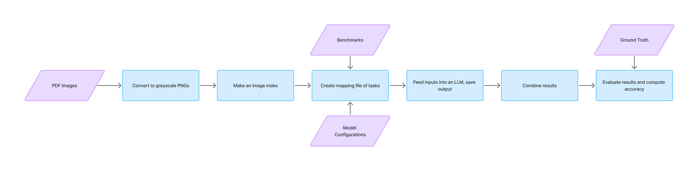
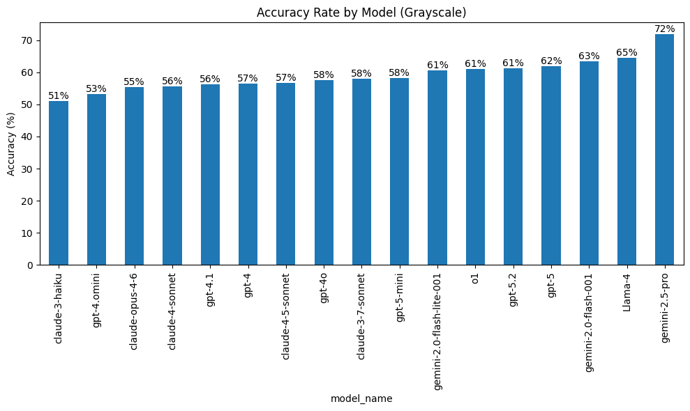
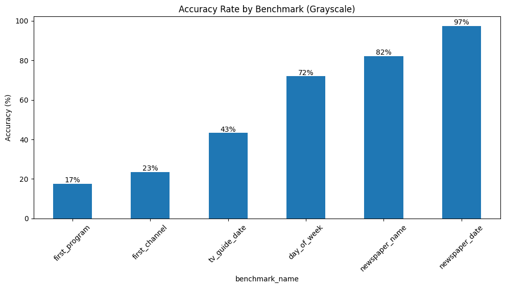
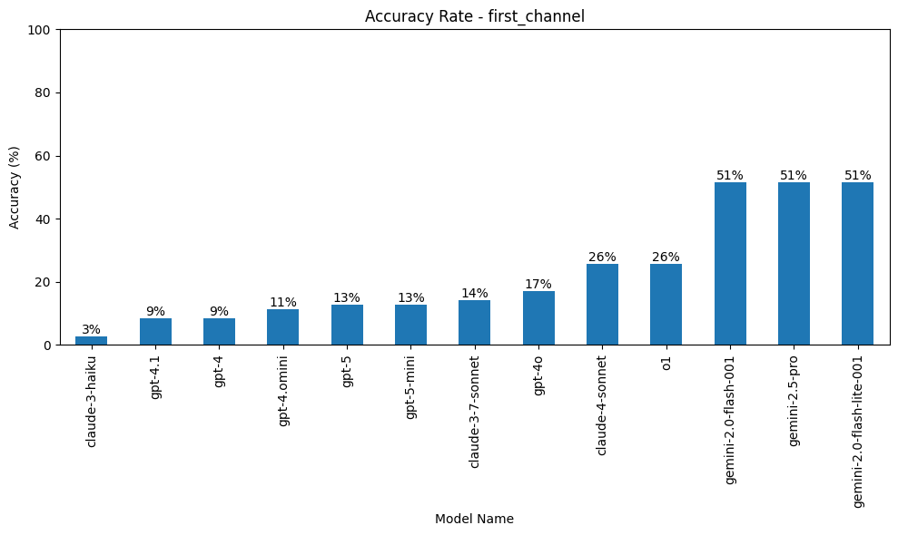
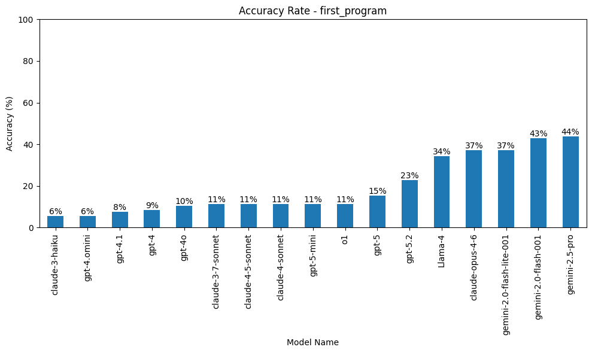
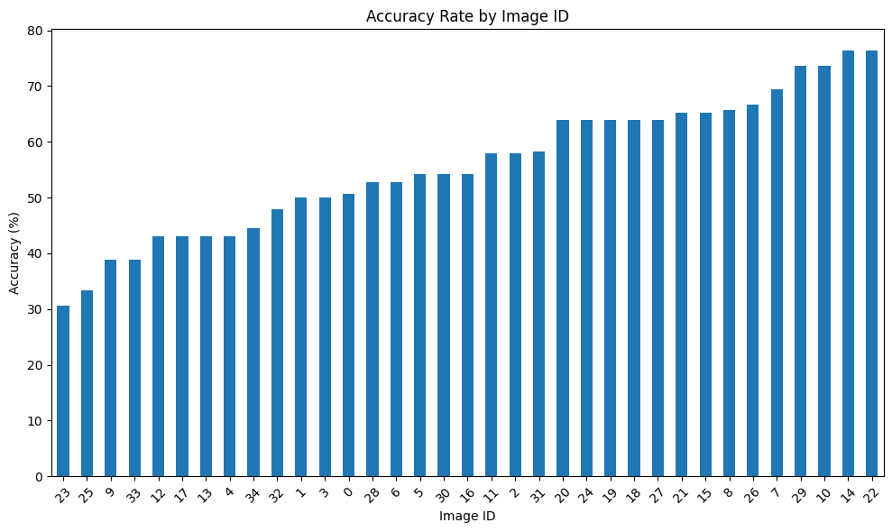

# [DARC Intern Project] Building Customizable LLM Evaluation Pipelines for Research

> Stanford's AI Playground allows researchers and staff access to almost 20 LLMs via their API. How do users determine which model is best suited for their needs? We built a pipeline that delivers a clear ranking of how different models perform on a set of benchmarks related to processing table based images.

> **This repo has two pipelines** that share one `.env`, `inputs/`, and a MongoDB backend:
> (1) the **inference pipeline** (`scripts/`) documented below, which runs LLMs over images and
> writes their outputs to Mongo; and (2) the **agentic metric-eval** (`agent_eval/` + `analysis/`),
> which *judges* those outputs—see
> [Agentic Metric-Eval & Dashboard](#agentic-metric-eval--dashboard). The agentic work is preserved
> on the archival handoff branch `mcp-metric-calc`.

> **Returning to this project:** start with [`PROJECT_STATUS.md`](PROJECT_STATUS.md), the dated
> archival handoff of what is verified, incomplete, and infrastructure-dependent. Then use
> [`agent_eval/README.md`](agent_eval/README.md) for design rationale and
> [`NEXT_STEPS.md`](NEXT_STEPS.md) for the chronological experiment record. Treat external service
> status, model availability, and prices as historical unless rechecked against their current source.

---

## Table of Contents

- [Context](#context)
- [Pipeline Overview](#pipeline-overview)
- [Try It Yourself](#try_it_yourself)
- [Agentic Metric-Eval & Dashboard](#agentic-metric-eval--dashboard)
- [Date-Fix Demo](#date-fix-demo)
- [Findings](#findings)
- [Next Steps](#next-steps)

---

## Context

Business and Social Science research, like the kind done at Stanford GSB, often requires data to be parsed from tables in scanned documents. These tables frequently have mixed resolutions, inconsistent formatting, and dense amounts of information which makes manual information extraction a time consuming task. Can we viably outsource this to LLMs?

### LLM Decision Fatigue

Choosing the right LLM is a deceptively tough task. The best choice LLM often depends on the images being processed, the information that needs to be extracted, and the budget for a project. Researchers often don't have the time to test models individually. New versions of models come out rapidly and their predecessors get retired just as frequently, when is it worthwhile for a user to modify their existing workflows with more recent LLMs?

### Our Approach

The goal of this project is to provide a personalized source of truth for LLM data parsing. As a proxy for typical research documents we used 34 scanned newspaper TV guides that varied in formatting and PDF clarity. These images were processed by 13 multimodal LLMs for the following 6 benchmarks:

    - 1. Newspaper Name: The name of the newspaper the tv guide is published in.
    
    - 2. Newspaper Date: The date the the newspaper was published on.

    - 3. Day of Week: The day of the week the TV guide is for.

    - 4. TV Guide Date: The date that the TV guide is for.

    - 5. First Program: The name of the program for the first channel listed and the earliest time slot.

    - 6. First Channel: The name of the first channel listed.

The unique combinations of images, models, and benchmarks amounted to 2,730 tasks that were fed through our pipeline.

---

## Pipeline Overview

We designed the pipeline to be modular so that changes to inputs (models, images, benchmarks) could be easily made with minimal changes to the main script. 



---

## Try It Yourself

If you're interested in reproducing this workflow, or customizing it for your specific benchmarks, you can follow the below steps.

### Clone the Repository

```bash
git clone https://github.com/gsbdarc/LLM_benchmarks
cd LLM_benchmarks
```

### Create and Activate a Virtual Environment

One repo-local Python 3.10 `.venv/` serves both pipelines and is gitignored. From the repository
root:

```bash
python3.10 -m venv .venv
source .venv/bin/activate
python -m pip install --upgrade pip
python -m pip install -r requirements.txt
```

If an existing environment uses the wrong Python version or has dependency problems, deactivate it,
delete `.venv`, and recreate it with the commands above.

### Understand Dependencies

- `requirements.in` is the short, human-maintained list of packages this repository directly uses.
- `requirements.txt` is the generated lock. It pins direct and indirect packages to exact versions
  so different branches and machines install the same environment.

Install dependencies from `requirements.txt`.

### MongoDB

MongoDB gives parallel inference jobs one shared place to store results.

- **Shared storage:** SLURM workers do not need to coordinate local result files.
- **Safe reruns:** Stable IDs and upserts let completed tasks be skipped and repeated writes update
  existing records.
- **Flexible records:** Document fields can vary as benchmark outputs and metadata evolve.
- **Downstream reuse:** Evaluation tools and live dashboards read the same central data.

MongoDB collections do not enforce one rigid schema. The table below lists the stable identity and
payload fields used by the current pipelines, rather than every optional field a document may hold.

| Collection | Purpose | Representative stable fields |
|---|---|---|
| `benchmarks` | Benchmark definitions and expected-output mappings | `_id`, `task_name`, `schema`, `ground_truth` |
| `ground_truths` | Human-extracted expected values for each image | `_id`, `image_id`, benchmark-specific expected fields |
| `llm_outputs` | Model outputs produced by upstream inference | `_id`, `task_id`, `run_id`, `benchmark_id`, `model_id`, `image_id`, `output`, `status` |
| `evaluations` | Scores from the deterministic evaluation pipeline | `task_id`, `benchmark_id`, `model_id`, `field_details`, `weighted_score` |
| `agentic_evaluations` | Versioned per-field verdicts from metric-eval agents | `eval_id`, `git_commit`, source identifiers, `field_evaluations` |
| `agentic_corrections` | Versioned date-repair decisions | `eval_id`, `git_commit`, `action`, `original_value`, `final_value`, review fields |
| `agentic_runs` | Judge configuration, performance, cost, routing, and trace metadata | `eval_id`, `git_commit`, judge configuration, run metrics, outcome fields |

The current implementation targets the `usf-internship` database in the DARC Atlas deployment.
Replication therefore requires network access plus `MONGO_DB_USERNAME` and `MONGO_DB_PASSWORD`.

### Tracing

Weave/W&B tracing is optional. Set `WANDB_API_KEY`, or disable tracing with `--no-weave` or
`EVAL_DISABLE_WEAVE=1` as appropriate.

### Environment Variables

See [`.env.example`](.env.example) for the complete template. For example:

```text
BASE_DIR=/path/to/LLM_benchmarks
STANFORD_API_KEY=your_key_here
MONGO_DB_USERNAME=your_username
MONGO_DB_PASSWORD=your_password
```

Do not commit `.env` or paste credential values into logs or issues.

> ⚠️ Note: as models get added & removed from the Stanford AI API you will need to submit a ticket to update your API key.

### Update Inputs (`LLM_benchmarks/inputs/`)

#### `models.json`

Defines which LLMs should be used to process tasks and their model-specific configurations, add or remove as needed.

Example:
```json
{
    "0" : {
        "model": "gpt-4",
        "family": "gpt",
        "max_context_input": 128000,
        "max_context_output": 4096,
        "max_context_window": 132096}
}
```

Note: max_context parameters are helpful for reference but not actually needed to run this pipeline. 

#### `benchmarks.json`

Defines **benchmark tasks** executed by LLMs.

Each benchmark should include:
- A unique ID
- A benchmark task name
- A system prompt
- A user prompt
- A benchmark task description
- An expected output schema

Example:
```json
{
    "0" : {
        "task_name": "newspaper_name",
        "system_prompt": "You are a metadata extraction assistant. Extract information from newspaper TV guide image. Always return valid JSON matching the exact schema provided.",
        "user_prompt": "Extract the newspaper name from this image.",
        "task_description": "Extraction: LLM should extract the name of the newspaper the TV guide is published in.",
        "schema":{
            "class_name": "NewspaperName", 
            "fields":{
                "newspaper_name": "str"}}}
}
```
### Run scripts (`LLM_benchmarks/scripts/`)

Scripts should be run in the order that they are numbered.

#### `1_pdf_to_png.py`

- Before running: upload PDFs to `LLM_Benchmarks/inputs/data/pdfs/`
- Converts PDFS into grayscale PNGs, saves files to `LLM_Benchmarks/inputs/data/pngs/`.
- Prints PNG paths and file sizes in MBs.

#### `2_make_index.py`

- Before running: upload CSVs to `LLM_Benchmarks/inputs/data/csvs/`.
- There should be a source of truth CSV for each PDF, naming should be the same excluding .png/.csv.
- Creates a JSON snapshot of paths for PNGs and their source of truth CSVs.

#### `3_create_mapping.py`

Creates a mapping file that: 
(1) finds all unique combinations of selected benchmarks, models, and images
(2) assigns a unique task id to each one
(3) saves these results into a csv file to be used in main.py

#### `4_extract_ground_truth.py`

- Context: ground truth csv files were created via human extraction. 
- Iterates through all of the CSVs in the image_index.
- Creates/updates ground truth JSON with the correct benchmark values.

> ⚠️ Note: this script needs to be customized based on what the benchmarks are. An example of how to extract the 'Day' field of the first row is below.

```python
day_of_week = csv_df['Day'][0]
```

#### `5_main.py`

- Orchestrates processing of a single task.
- Tasks are loaded via the mapping.csv file.
- If the task has not already been processed then the corresponding benchmark, model, and image are loaded from their respective JSONs.
- A pydantic model and prompts are passed into an LLM via the Stanford AI API.
- The following outputs are saved to the DARC MongoDB shard

```json
{
    "_id": "0_1",
    "task_id": "0",
    "run_id": 1,
    "output": "Arizona Republic",
    "model_name": "gpt-4",
    "model_id": "1",
    "image_id": "0",
    "benchmark_name": "newspaper_name",
    "benchmark_id": "0",
    "completion_tokens": 9,
    "total_tokens": 1196,
    "status": "processed",
    "run_number": 1,
    "updated_at": "April 1st, 12pm"
}
```

On YENs, edit `yens.slurm` for the desired array job. It activates the repo-local `.venv/` (one level
up), so submit it from the `scripts/` directory.

Example:
```bash
cd scripts && sbatch yens.slurm
```

#### `6_combine_check_results.py`
- Loads all results within the `LLM_Benchmarks/outputs/results/` directory.
- Combines results into a single DataFrame.
- Saves the results to `LLM_Benchmarks/outputs/results/metrics/combined_results.json`
- Prints the total number of successful and unsuccessful tasks, returns dictionary of error messages with counts.

#### `7_compute.py`
- Loads combined_results.json and filters for tasks that have been processed.
- Evaluates model outputs compared to ground truth, assigns a accuracy score based on exact matching.
- Saves results as a `LLM_Benchmarks/outputs/results/metrics/metrics.json`

---

## Agentic Metric-Eval & Dashboard

The scoring step above (`7_compute.py`, deterministic exact-match) has been reimagined as an **agent**. Instead of code picking a metric per field, an **MCP agent** — an LLM "judge" — reads each field's predicted-vs-expected values (the `llm_outputs` written by `5_main.py`) from Mongo, infers the data shape, routes it to the right composite scoring tool over MCP, and saves a verdict; results feed a live dashboard. We measure how well it routes plus performance/cost. This is the **current active work** (branch `mcp-metric-calc`) and lives in `agent_eval/` + `analysis/`.

It reuses the same `.venv`, `.env`, and Mongo as above. Quickstart (**from the repo root**):

```bash
source .venv/bin/activate
cd agent_eval && EVAL_DISABLE_WEAVE=1 python -m pytest ; cd ..        # tests (offline)
python -m agent_eval.registry.create_eval_mapping --sample 100        # build a work sample
sbatch agent_eval/scripts/run_eval_batch.slurm                        # run a batch (starts its own MCP server + fans out)
python -m analysis.serve_dashboard                                    # live dashboard @ http://127.0.0.1:8787
#   or a static file:  python -m analysis.build_dashboard --no-summaries --open
```

The harness runs **two tasks** on this same machinery — the metric-eval above, and a date-repair task
covered in [Date-Fix Demo](#date-fix-demo) below.

- **Design + module layout:** [`agent_eval/README.md`](agent_eval/README.md)
- **Live status / roadmap:** [`NEXT_STEPS.md`](NEXT_STEPS.md)
- **For AI coding agents:** [`CLAUDE.md`](CLAUDE.md) and the `agentic-eval` skill in [`.claude/skills/`](.claude/skills/) orient an agent automatically.

---

## Date-Fix Demo

The same harness runs a **second task**, and it's the easiest one to see the point of. A TV guide
covers one particular day — but that date is *not printed on the page*. It has to be derived from two
things that are: the date the newspaper was published, and which day of the week the guide is for.
The models above extracted all three values independently, so the derived `tv_guide_date` is often
inconsistent with the other two.

So we pointed an agent at it. For each case it loads the model's three answers, derives the correct
date with a tool, and records one decision — **corrected**, **confirmed**, or **abstained** (some
guides span several days, so no single date is right, and inventing one would be worse than saying
so). It never sees the ground truth; that's held back and used only to grade it afterwards.

The demo page reports what each judge fixed, what it left alone, what it handed back to a human, what
it cost, and the step-by-step trace behind every row.

### See it

```bash
source .venv/bin/activate
python -m analysis.serve_demo        # prints the URL and the exact `ssh -L` line to reach it
```

The server binds localhost on the Yens node, so forward the port from your laptop — the command
prints the line to copy, and VS Code's **Ports** panel does the same thing automatically. Reading
the page needs Mongo credentials (`MONGO_DB_USERNAME` / `MONGO_DB_PASSWORD` in `.env`) and at least
one date-fix batch already run; with no runs the page tells you so rather than erroring.

For a self-contained file you can email or open from disk instead:

```bash
python -m analysis.build_date_fix_demo        # -> images/date_fix_demo.html
```

To run the task from scratch, see [`agent_eval/README.md`](agent_eval/README.md#two-tasks-on-one-harness).

---

## Findings

We ran each task 3x with results showing that gemini-2.5-pro was the most accurate multimodal model in the Stanford AI Playground API at the time of testing (March 17th, 2026). We've now added Claude-4-5-Sonnet, Claude-Opus-4-6, Llama-4, and gpt-5.2 into our evaluation pipeline. 

### Accuracy by Model

Overall model accuracy across all benchmarks and images.



### Accuracy by Benchmark

Simple metadata extraction benchmarks (Newspaper Name, Newspaper Date) had the highest accuracy while LLMs struggled to return accurate results for benchmarks that required some reasoning (TV Guide Date) and scanning the document (First Channel, First Program).



Double clicking into these document scanning benchmarks we found that the Gemini and Llama-4 models outperformed their peers.





Across runs accuracy rates by both benchmark and model remained stable. Where we saw the most variablity was in specific combinations of benchmarks and models - ex. first program with gemini-2.0-flash-001 had a standard deviation of 5.7%. The model temperatures had been set to 0 (the most deterministic) and with 35 images changes in response to 1 or 2 can lead to noticeable fluctuations in accuracy rates.

### Accuracy by Image Id

When analyzing results by image id we found that there was about a 40% difference between the image associated with the lowest accuracy and the image associated with the highest accuracy.



### Token Cost

The original project notes said that, although o1 was the sixth most accurate model, it used almost
4.7 times as many tokens as gemini-2.5-pro. This archived claim has not been fact-checked, and the
referenced `images/token_cost.png` figure was never tracked. Treat it as unfinished analysis rather
than a supported result; `images/model_tokens.png` is a different average-token table and does not
substantiate this paragraph.

Double clicking into metadata extraction benchmarks Newspaper Name and Newspaper Date found similar results could be produced for varying costs. Claude-3-haiku models returned Newspaper Name and Newspaper Date just as accurately as gemini-2.5-pro (100%) but only cost $0.06 or 1/24 as much. Similarly gemini-2.0-flash-lite-001 got Newspaper Date correct 100% of the time but only cost $0.03 vs $1.49 for gemini-2.5-pro. 

### Limitations

While building and testing this pipeline we identified a couple of opportunties of improvement related to the Stanford AI Playground API. 

Changes to avaiable models are not always consistently announced and often require manual combing through the ai-playground slack channel. Once these changes go into effect API keys need to be rerequested, otherwise they continue to reflect access to models that are no longer available. It would be helpful if API keys would automatically remove retired models and request forms would allow users to signal that they want access to all future models as well.

---

## Next Steps

Current development is the **agentic metric-eval** (branch `mcp-metric-calc`). Live detail + runbook in [`NEXT_STEPS.md`](NEXT_STEPS.md); the headline threads:

- **Prompt A/B:** `composite_v2` was measured against `composite_v1` — it's leaner (fewer redundant tool calls, lower cost) but less reliable at finishing the save on weaker models. A `v2.1` that restores a "you're not done until you save" nudge is the next prompt iteration.
- **Local judge:** add a local **Qwen-3.6-35B** vLLM judge (2× A40) as a 4th judge alongside the hosted Playground models (scaffolding built; needs a GPU allocation to run).
- **Reliability:** harden malformed tool-call handling (a bad tool-call JSON currently poisons the conversation and hard-fails the run) and enforce valid tool JSON via constrained decoding on the local judge.
