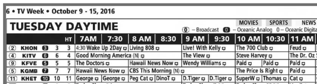
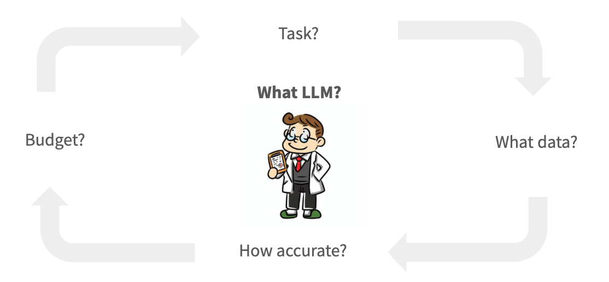
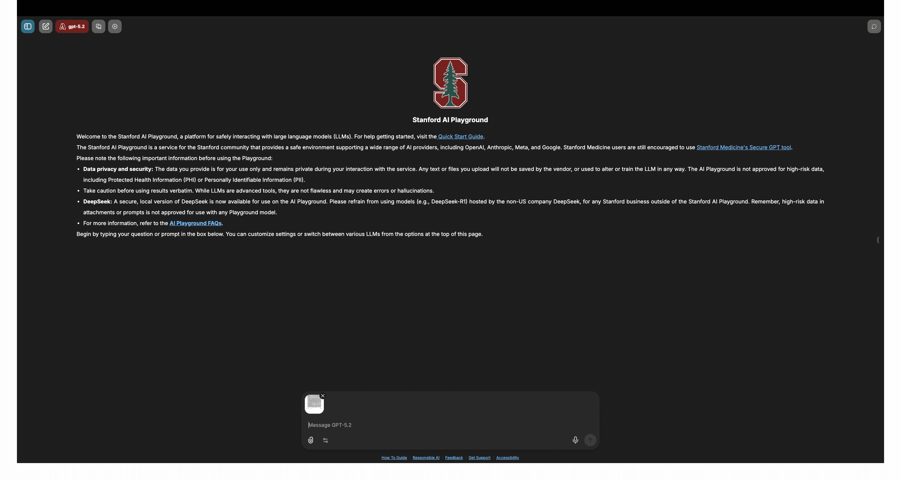
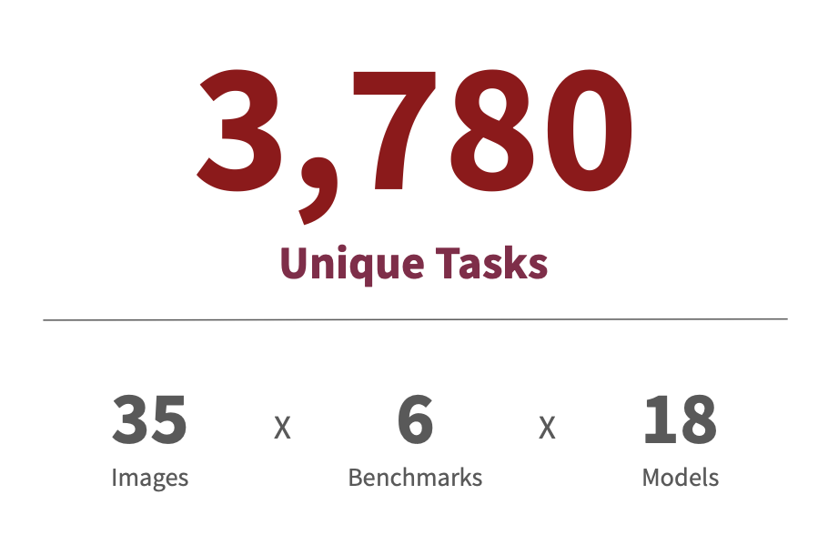
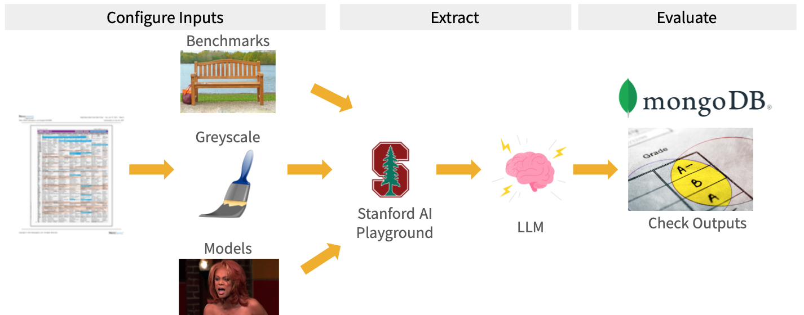

# Scalable AI or Manual Labor? Designing an LLM Evaluation Framework for Historical Data

### *How we automated the benchmarking of 18 multimodal AI models to digitize archival TV guides.*

| Date | Created | Categories | Authors |
| :--- | :--- | :--- | :--- |
| 2026-05-19 | 2026-05-19 | LLM, Data Extraction | ltdarc |

---

## Executive Summary (TL;DR)
If you are a researcher looking to digitize archival text or structured historical images using Large Language Models (LLMs), blindly picking a model can lead to high costs and poor accuracy. We built an automated evaluation framework to systematically benchmark **18 multimodal AI models** across **35 evaluation images** spanning **6 tasks** (nearly 3,800 combinations).

**Key Takeaways:**
* **Prompt Precision Matters:** Moving from simple instructions to a structured, step-by-step grid navigation prompt increased accuracy for our hardest task from **44% to 100%** using top-tier models.
* **Ditch Binary Evaluation:** Traditional exact-matching metrics are too rigid for text extraction. Transitioning to gradient metrics (similarity scoring) provides a realistic signal of model performance.
* **Cost vs. Capability:** An automated framework helps researchers identify the exact inflection point where smaller, cheaper models can safely replace expensive frontier models.

---

## Introduction

Designing LLM Evaluation Frameworks may sound like a highly specialized engineering niche, but it is actually an essential first step in any robust, AI-driven research workflow. In the context of empirical research, an LLM Evaluation Framework is a systematic, reproducible experiment designed to test how accurately various artificial intelligence models complete a specific data extraction task.

In this project, our task was to extract structured data from historical, printed TV Guide images. A robust framework allowed us to quickly benchmark how different models perform across a representative sample of our data *before* committing thousands of dollars in computing credits or API fees to process an entire archival collection.

This article covers the conceptual framework behind designing an LLM evaluation system for a TV Guide data extraction project, our results, and key takeaways for researchers looking to build similar pipelines.

> 💡 **Replicate Our Work:** You can access the complete [LLM Benchmarks GitHub Repository](https://github.com/gsbdarc/LLM_benchmarks) to explore, customize, and deploy this evaluation framework for your own datasets.

---

## The Research Bottleneck: Data Extraction is Time Consuming

For social science, history, and business research, valuable data is often trapped inside dense tabular images, historical newspapers, SEC filings, or city council minutes. Consider historical TV Guides: printed weekly schedules listing channels, time slots, and programs for a given media market. These documents offer a rich look into cultural and media history, but the data locked inside them cannot be queried, aggregated, or computationally analyzed without first being digitized.



Traditionally, digitizing these images required manual labor. A project supervisor would outsource pages to a third party or a team of student research assistants with instructions to manually transcribe the data cell-by-cell into a spreadsheet, followed by a secondary review process to spot human error. While accurate, this methodology is deeply time-intensive, expensive, and fundamentally bottlenecked at scale.

---

## Exploring AI Alternatives: The Playground vs. The API

Large Language Models (LLMs) are highly capable tools for structured text extraction, but choosing whether and how to integrate them into an academic workflow introduces a deceptively difficult multi-variable optimization problem.



As the matrix shows, these four factors do not exist in isolation. Strict budget constraints might force you to rely on smaller, less accurate open-source models; unique spatial layouts in your data might eliminate language-only models entirely; and your acceptable accuracy thresholds may shift as you uncover structural edge cases in your documents. Because these variables are deeply interdependent, a systematic evaluation framework is crucial.

As a quick proof-of-concept, you can log into the **Stanford AI Playground**—a graphical user interface (GUI) allowing users to manually upload an image, type a prompt, and see an output within seconds.



While excellent for exploratory testing, manual interfaces fail when trying to systematically select the absolute best model for a project. To find the optimal setup, we need to test across every available multimodal LLM (models capable of processing both visual images and text strings simultaneously). That includes over 20 unique models.

Furthermore, evaluating models based on a single image can lead to statistical noise. A researcher needs to test performance across a representative validation sample of multiple images and extract several distinct variables (benchmarks) per image.

> 💡 **Jargon Buster: Multimodal LLM**
> A multimodal Large Language Model is an AI system capable of processing multiple types of input—such as reading text *and* analyzing visual features within an image simultaneously.



When we evaluate **35 validation images**, **6 unique benchmark targets**, and **18 distinct models**, we quickly reach **3,780 unique combinations**. Programmatically feeding these one-by-one into a web interface is impossible. To scale this, we must shift from manual interfaces to automated pipelines.

---

## Building Automated Compute Pipelines

To handle this matrix at scale, we constructed an automated pipeline. Below is a visual representation of our architecture, which processes tasks programmatically rather than manually.



To support this computationally, we leveraged **Yens** (Stanford's high-performance computing cluster) and utilized **SLURM array jobs** (a workload manager that allows us to execute hundreds of extraction tasks simultaneously in parallel). This infrastructure handles the heavy lifting of image preprocessing, batch API calls to model providers, and saving JSON-structured outputs.

### Selecting Inputs and Structuring Schemas

Every extraction task requires an exact instruction set paired with a schema enforcement mechanism to guarantee that the AI returns machine-readable JSON rather than conversational text.

```json
{
    "task_name": "newspaper_name",
    "system_prompt": "You are a metadata extraction assistant. Extract information from newspaper TV guide image. Always return valid JSON matching the exact schema provided.",
    "user_prompt": "Extract the newspaper name from this image.",
    "task_description": "Extraction: LLM should extract the name of the newspaper the TV guide is published in.",
    "schema": {
      "class_name": "NewspaperName",
      "fields": {
        "newspaper_name": {
          "type": "string"
        }}}
}
